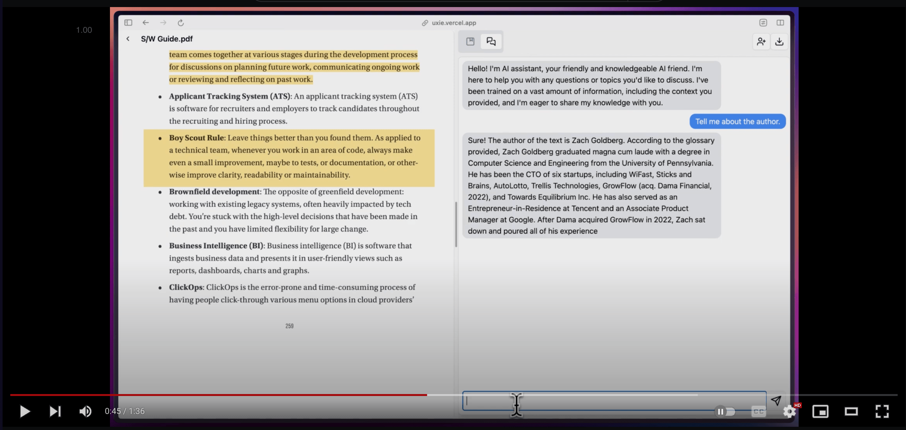

# [Uxie](https://uxie.vercel.app)

PDF reader app designed to revolutionise your learning experience!

🚀 Developed with features like:

- 📝 Annotation, note-taking, and collaboration tools
- 📚 Integrates with LLM for enhanced learning
- 💡 Generates flashcards with LLM feedback

Originally started as a hackathon project which I ended up winning 🥇! Uxie has since evolved with even more exciting features.
I'd love for you to give Uxie a try and share your valuable [feedback](https://uxie.vercel.app/feedback).

### Built using

- **Nextjs** Frontend and Serverless api routes
- **tRPC** For typesafe apis
- **Zod** For validation
- **Typescript** For type safety
- **Tailwind CSS** For CSS
- **React Query** for data fetching, optimistic updates
- **React Hook Form** for form handling
- **Shadcn UI + Radix UI** For UI components
- **Supabase** As the database
- **Prisma** As the ORM
- **Blocknote** for note taking
- **Uploadthing** for storing pdfs
- **Next Auth** for authentication
- **React-pdf-highlighter** for pdf rendering,highlighting
- **Vercel AI SDK, Langchain** for AI responses and streaming, generating flashcards + evaluating them
- **Pinecone DB** for storing embeddings of pdfs
- **Fireworks AI** for LLM
- **Huggingface Model** for generating Embeddings
- **Liveblocks** for realtime collaboration
- **Nuqs** for type-safe search params

## Features:

- Note taking, later download the note as markdown
- Summarise, ask questions about the PDFs
- Chat and collab with other (collaboration disabled for now-hit free tier limits :'(
- Custom blocks in editor
- highlights block which on click takes you to that highlight on the doc.
- AI-powered text autocompletion, and text enhancement
- PDF text-to-speech (English only)
- PDF ocr support (English only)
- Craft simple flashcards to test your knowledge, answer questions, and receive instant feedback through AI evaluation.

### Bugs

- [ ] throw proper errors while uploading files => even for large files ,it says max 1 file.
- [ ] add proper prompts for each item in custom/ai/popover.tsx
- [ ] display a x% done in /f, also scroll to that page on opening the file. add a go-to-page-numb option in bottom-toolbar => along with zoom, etc)
- [ ] ffs build a category system for documents => doesnt matter if ui is bad, just build it
- [ ] implement ratelimit using redis kv => checkout upstash
- [ ] add download flashcards in csv,anki format ( apkg format), also add dl notes in pdf format ([html2pdf lib](https://ekoopmans.github.io/html2pdf.js/) should work)
- [ ] better error,loading pages => abstract this logic to hook / component
- [ ] editor loads with empty data before the data is loaded.
- [ ] see if u can see all the users (also typing status for chat: [refer](https://github.com/konradhy/build-jotion/blob/master/components/editor.tsx#L93)) in the liveblocks room, (and display it at top)
- [ ] fix `.tippy-arrow` appearing on screen at all times => added a temp fix. still appears when hovered over the pdf reader
- [ ] abstract userIsOwner and userHasAccess (either collab or owner) logic.
      solution seems to be => create separate helper functions (take where, select, etc as params: use relevant prisma types to match each.)

### TTS Tasks left:

- add multi-language support (works only for english now, atleast mention this somewhere ig)
- experiment with the voice (changing pitch, etc)
- add an onboarding flow for this? just explaining what it is and all
- some way to hide the bottom-toolbar (separate settings page or just drag to side?)

## New ideas

- [ ] profile how long pinecone takes for retrieval of embeddings, and maybe look into upstash embedding storage for this (or pgvector?)
- [ ] For area-highlight

      - store it as base64 to the notes, then in the same addhighlighttonotes function upload it to uploadthing, and then update the url of the block in the notes. => would prob need to create a custom block for this, else there'd be a noticable lag.
      - add the yellow leftborder which takes to the image highlight on click

- [ ] use background runner or something and do long-polling
- [ ] store the content of text-highlight and make it available for search (from a cmd+k window, and maybe also from /f) => prob not useful for image-highlights
- [ ] see if the liveblocks stuff can be replaced w. sockets [refer](https://www.blocknotejs.org/docs/real-time-collaboration#yjs-providers)
- [ ] Run the seogets script
- [ ] send page number whenever tool-calling is used, then display it under the text. (which takes to that page on click)
- [ ] add bm25 along w vector embeddings? https://www.anthropic.com/news/contextual-retrieval#:~:text=BM25%20can%20succeed%20where%20semantic%20embeddings%20fail

### Pinecone Setting up guide

- Create index => Dimensions = 768, Metric = Cosine
