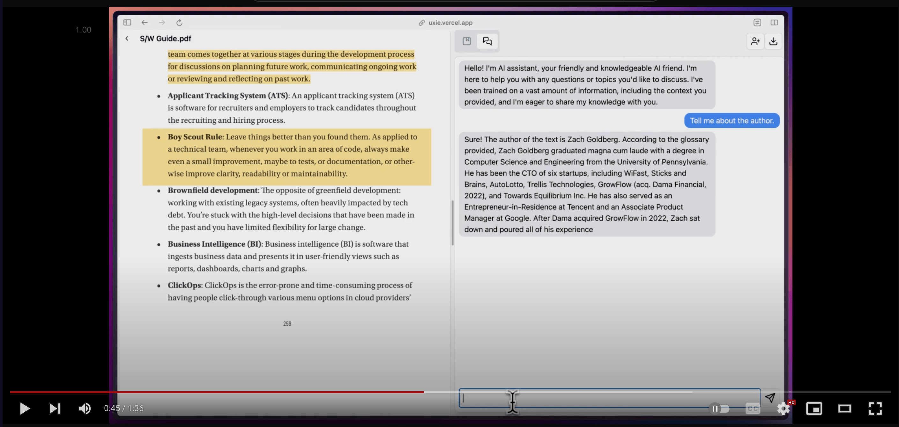

# [Uxie](https://uxie.vercel.app)

[](https://www.youtube.com/watch?v=m97zcPWSceU)

PDF reader designed to revolutionise your learning experience — annotate, take notes,
and talk to your documents.

Originally a hackathon project which I ended up winning 🥇, Uxie now ships as **two apps
from one codebase**: the hosted web app, and a local-first desktop app where your
documents and inference never leave your machine.

I'd love for you to give it a try and share your [feedback](https://uxie.vercel.app/feedback).

## The two apps

|                | **Web** (`apps/web`)                   | **Desktop** (`apps/desktop`)                     |
| -------------- | -------------------------------------- | ------------------------------------------------ |
| Runtime        | Next.js on Vercel                      | Electron (macOS arm64)                            |
| Data           | Supabase Postgres via Prisma           | SQLite on disk via Drizzle                        |
| Files          | Uploadthing                            | Local `userData` folder, served over `uxie-pdf://` |
| Vectors        | Pinecone (768-dim)                     | sqlite-vec (768-dim)                              |
| Embeddings     | `bge-base-en-v1.5` via Hugging Face API | the same model, run on-device via transformers.js |
| LLM            | Google Gemini                          | Any OpenAI-compatible endpoint you point it at    |
| Auth           | NextAuth (Google)                      | None — single local user                          |
| Collaboration  | Liveblocks                             | —                                                 |
| Accounts/plans | Free / Free Plus / Pro limits          | No limits                                         |

Both render the same reader, notes editor, flashcards and chat UI out of `shared/`.

> Both apps embed with the same model at the same dimension
> (`shared/lib/embedding-models.ts`); desktop just runs it locally rather than calling
> an API. The stores still hold slightly different vectors — desktop uses the quantized
> `q8` build — so they aren't byte-for-byte interchangeable, but the dimensions match.

## Features

- Highlight and annotate PDFs; highlights link back into your notes and jump to the page on click
- Note taking with custom blocks, AI autocompletion and text enhancement; export as markdown
- Summarise and ask questions about a PDF (RAG, with tool-calling on desktop)
- Flashcards with AI evaluation of your answers
- PDF text-to-speech with sentence-by-sentence highlighting (local models or the browser's)
- Reading modes: bionic, RSVP, read-along, full-screen, disable-hyperlinks
- PDF OCR (English only) — web
- Realtime collaboration — web (currently disabled, free-tier limits)

## Repo layout

```
apps/
  web/        Next.js app          → apps/web/README.md
  desktop/    Electron app         → apps/desktop/README.md
shared/       UI + logic used by both → shared/README.md
scripts/      release.sh, generate-icons.sh
patches/      pnpm patch for react-pdf-highlighter
```

pnpm workspace, packages named `@uxie/web`, `@uxie/desktop`, `@uxie/shared`.

## Getting started

**Prerequisites:** [Node.js](https://nodejs.org/en/) 20+, [pnpm](https://pnpm.io/installation) 9.

```bash
git clone https://github.com/zeus-12/uxie.git
cd uxie
pnpm install
```

Then follow whichever app you want to run:

- **Web** — needs Supabase, Uploadthing, Pinecone, Google OAuth + Gemini keys.
  See [`apps/web/README.md`](apps/web/README.md).
- **Desktop** — needs no accounts or keys to start; you point it at an LLM endpoint
  in Settings on first run. See [`apps/desktop/README.md`](apps/desktop/README.md).

### Root scripts

| Command               | What it does                                     |
| --------------------- | ------------------------------------------------ |
| `pnpm dev:web`        | Next dev server on :3000                          |
| `pnpm dev:desktop`    | electron-vite dev (rebuilds native modules first) |
| `pnpm build:web`      | Production Next build                             |
| `pnpm build:desktop`  | Bundle main/preload/renderer into `apps/desktop/out` |
| `pnpm typecheck`      | Typecheck both apps                               |
| `pnpm lint`           | ESLint (web)                                      |
| `pnpm format`         | Prettier across the repo                          |
| `pnpm release <ver>`  | Tag and push a desktop release (see below)        |

## Releasing the desktop app

```bash
pnpm release 0.1.1
```

Bumps `apps/desktop/package.json`, commits, tags `v0.1.1`, pushes. The tag push triggers
`.github/workflows/release.yml`, which builds an **unsigned arm64 DMG** on `macos-14` and
publishes a GitHub Release. Releases must be cut from a clean `main`; the workflow refuses
to publish a tag that isn't an ancestor of `main`.

Because the DMG is unsigned, first launch needs right-click → Open (or
`xattr -dr com.apple.quarantine /Applications/Uxie.app`).

## Contributing

Issues and PRs welcome — [github.com/zeus-12/uxie](https://github.com/zeus-12/uxie/issues).
Fork, branch, commit, open a PR against `main`.

Please run `pnpm typecheck` and `pnpm format` before opening a PR.
